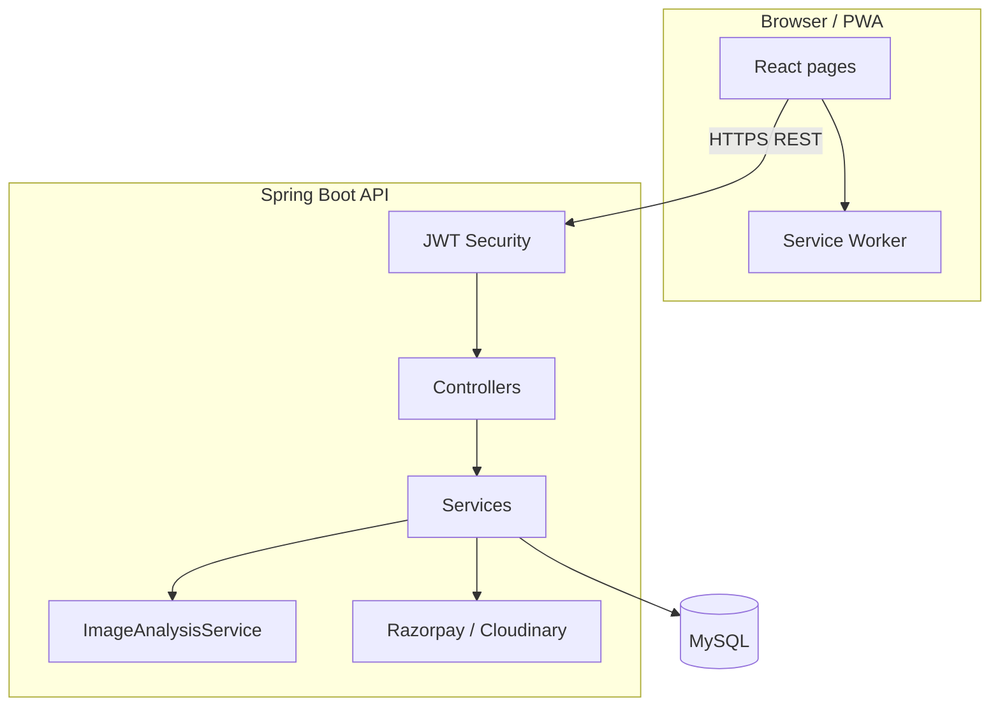

# Zivro — AI-Assisted Home Service Marketplace

**Zivro** is a full-stack web application (website + installable mobile app) that connects **customers** who need home services with **verified workers** who perform the job. Think of it like a simplified Uber/Rapido, but for cleaning, cooking, laundry, plumbing, and similar tasks.

This document explains **what** the project does, **how** it is built, **where** each part lives, and **how to run it on your computer** or **publish it on the internet** (Vercel + cloud database + API hosting).

---

## Table of contents

1. [What can users do? (Plain English)](#1-what-can-users-do-plain-english)
2. [Tech stack (in order)](#2-tech-stack-in-order)
3. [Project folder map — what is where](#3-project-folder-map--what-is-where)
4. [Everything implemented (feature list)](#4-everything-implemented-feature-list)
5. [User roles & login](#5-user-roles--login)
6. [Admin account credentials](#6-admin-account-credentials)
7. [Run locally on your computer](#7-run-locally-on-your-computer)
8. [Publish online — Vercel + API + MySQL](#8-publish-online--vercel--api--mysql)
9. [Environment variables (complete reference)](#9-environment-variables-complete-reference)
10. [Website pages (frontend routes)](#10-website-pages-frontend-routes)
11. [REST API (complete list)](#11-rest-api-complete-list)
12. [Database tables](#12-database-tables)
13. [Architecture diagram](#13-architecture-diagram)
14. [Testing](#14-testing)
15. [Troubleshooting](#15-troubleshooting)
16. [Future improvements](#16-future-improvements)

---

## 1. What can users do? (Plain English)

| Who | What they do on Zivro |
|-----|------------------------|
| **Customer** | Browse 15+ services with icons → upload a photo → AI estimates room size / utensils / appliance type and cleaning time → pick location (GPS or typed address) → book → see nearby workers until one accepts → pay deposit (optional Razorpay) → rate after job |
| **Worker** | See open jobs near them → view customer location on Google Maps → accept job → upload before/after photos → start → complete |
| **Admin** | Dashboard with stats → verify workers → resolve disputes → manage service catalog via API |

**Extra UX features:**
- **PWA (Progressive Web App)** — install on Android/iPhone like a native app
- **Nearby workers animation** on pending bookings (Rapido-style “finding pros near you”)

---

## 2. Tech stack (in order)

Built from the **database up** to the **user’s screen**:

| Layer | Technology | Why it is used |
|-------|------------|----------------|
| **1. Database** | MySQL 8.x | Stores users, workers, bookings, payments, images metadata, AI analysis, locations |
| **2. Schema migrations** | Flyway (`V1`–`V6` SQL files) | Applies database changes safely on every deploy |
| **3. Backend language** | Java 21 | Main server programming language |
| **4. Backend framework** | Spring Boot 3.4 | REST API, security, database access, file uploads |
| **5. ORM** | Spring Data JPA / Hibernate | Maps Java objects to database tables |
| **6. Security** | Spring Security + JWT (HS256) | Login tokens; roles: USER, WORKER, ADMIN |
| **7. API docs** | SpringDoc OpenAPI (Swagger UI) | Interactive API documentation at `/swagger-ui.html` |
| **8. Image storage** | Cloudinary (optional) or local disk fallback | Reference / before / after job photos |
| **9. Payments** | Razorpay (optional) | Deposit + balance checkout in INR |
| **10. AI analysis** | Java `ImageAnalysisService` (on-server heuristics) | Detects room/utensils/appliance from uploaded photo; estimates quantity & minutes |
| **11. Frontend framework** | React 18 | Interactive website UI |
| **12. Build tool** | Vite 5 | Fast dev server and production bundle |
| **13. Styling** | Tailwind CSS 3 | Modern responsive design |
| **14. Animations** | Framer Motion | Smooth page transitions and nearby workers panel |
| **15. Charts (admin)** | Recharts | Admin dashboard graphs |
| **16. HTTP client** | Axios | Frontend talks to backend API |
| **17. PWA** | vite-plugin-pwa + Workbox | Offline shell, installable app, service worker |
| **18. Local DB (optional)** | Docker Compose | Runs MySQL in a container for development |

**Requirements on your machine (local dev):**
- Java 21+, Maven 3.9+, Node.js **20+**, MySQL 8.x (or Docker)
- Windows / macOS / Linux

---

## 3. Project folder map — what is where

```
d-zivro/
├── backend/                    ← Java API (the “brain” of the app)
│   ├── src/main/java/com/zivro/
│   │   ├── controller/         ← HTTP endpoints (URLs the app calls)
│   │   ├── service/            ← Business logic (bookings, AI, payments…)
│   │   ├── domain/             ← Database entity classes
│   │   ├── dto/                ← Request/response shapes for API
│   │   ├── repository/         ← Database queries
│   │   ├── config/             ← Security, JWT, admin bootstrap, Cloudinary
│   │   └── media/              ← Image upload implementations
│   ├── src/main/resources/
│   │   ├── application.yml     ← Server settings & env var names
│   │   └── db/migration/       ← Flyway SQL (V1…V6)
│   └── target/zivro-api-*.jar  ← Built server file (after `mvn package`)
│
├── frontend/                   ← React website (what users see)
│   ├── public/
│   │   └── icons/              ← PWA app icons
│   ├── src/
│   │   ├── pages/              ← Home, Services, Book, Bookings, WorkerJobs…
│   │   ├── admin/              ← Admin dashboard, workers, disputes
│   │   ├── components/         ← PWA install, AI card, location picker
│   │   ├── auth/               ← Login state & JWT storage
│   │   └── api/client.js       ← Axios base URL to backend
│   ├── .env                    ← VITE_API_URL (create from .env.example)
│   └── dist/                   ← Production build output (for Vercel)
│
├── docker-compose.yml          ← Starts local MySQL only
├── scripts/smoke-test.ps1      ← Automated test script (Windows PowerShell)
└── README.md                   ← This file
```

---

## 4. Everything implemented (feature list)

### Authentication & users
- [x] Register as **Customer (USER)** or **Worker (WORKER)**
- [x] Login / logout with JWT (24h token, stored in browser)
- [x] Profile page (`/dashboard`) from `/api/auth/me`
- [x] **Admin** created only via server bootstrap env vars (not self-register)

### Service catalog (15 services with icons & categories)
- [x] Full home cleaning, room cleaning, washroom, utensils, dishes, laundry, home keeping, cooking, painting, packing & movers, vehicle cleaning, hardware setup, appliance cleaning, AC service, plumbing
- [x] Category filters on `/services`
- [x] Live price quote by urgency (Normal / Urgent / Same day) + peak-hour IST pricing
- [x] Admin CRUD for services via API

### Booking flow
- [x] Reference photo upload or camera capture (required)
- [x] **AI image analysis** — detects room, utensils, dishes, appliances, vehicle; estimates sq ft / count / minutes / stain level
- [x] **Location required** — current GPS or “other location” typed address
- [x] Optional schedule (date + 1-hour slot)
- [x] Booking statuses: `PENDING` → `ACCEPTED` → `IN_PROGRESS` → `COMPLETED` (or `CANCELLED`)
- [x] **Nearby workers** list while pending (distance km, ETA minutes)
- [x] **Google Maps link** on booking for workers and customers

### Worker workflow
- [x] Unassigned job pool (`/worker/jobs`)
- [x] Accept / reject pre-assigned jobs
- [x] Before-work & after-work photo uploads
- [x] Start job → complete job gates
- [x] Customer location + map link visible before accepting

### Payments (Razorpay — optional)
- [x] Deposit order on booking create (25% default)
- [x] Balance payment after rating (satisfaction-based final price)
- [x] Payment verify endpoint + webhook handler
- [x] Deposit gate before worker accept (configurable)

### Ratings & disputes
- [x] Dual rating: worker quality + overall satisfaction
- [x] Worker aggregate rating updated
- [x] Customer dispute after completed job; admin resolve

### Admin panel
- [x] `/admin/dashboard` — stats + charts
- [x] `/admin/workers` — verify / revoke workers
- [x] `/admin/disputes` — list & update disputes
- [x] Service catalog admin API (no dedicated UI page yet)

### Frontend UX
- [x] PWA — installable on Android/iOS, standalone mode, icons
- [x] Install app banner (Chrome `beforeinstallprompt`)
- [x] Responsive dark theme (Tailwind)

---

## 5. User roles & login

| Role | How to get account | Main pages |
|------|-------------------|------------|
| **USER** | Register at `/register` → choose Customer | `/services`, `/book/:id`, `/bookings` |
| **WORKER** | Register at `/register` → choose Worker | `/worker/jobs` |
| **ADMIN** | Created by server on startup (see below) | `/admin/dashboard`, `/admin/workers`, `/admin/disputes` |

**Important:** Workers must be **verified by admin** before customers can rely on them; admin verifies at `/admin/workers`.

---

## 6. Admin account credentials

The admin user is **not** created through the public register page. It is created automatically when the backend starts **if** these environment variables are set:

| Variable | Example value |
|----------|---------------|
| `ZIVRO_BOOTSTRAP_ADMIN_EMAIL` | `admin@zivro.com` |
| `ZIVRO_BOOTSTRAP_ADMIN_PASSWORD` | `admin` |
| `ZIVRO_BOOTSTRAP_ADMIN_NAME` | `Admin` (optional) |

### Default admin login (local development)

If the backend was started with bootstrap env vars, use:

| Field | Value |
|-------|-------|
| **Email** | `admin@zivro.com` |
| **Password** | `admin` |
| **Login URL** | http://localhost:5173/login |
| **Admin panel** | http://localhost:5173/admin/dashboard |

> **Security warning:** Change `admin` to a strong password before deploying to the internet. Never commit real passwords to Git.

### Create admin on first backend start

1. Ensure your `backend/.env` file contains the bootstrap variables:
```env
ZIVRO_BOOTSTRAP_ADMIN_EMAIL=admin@zivro.com
ZIVRO_BOOTSTRAP_ADMIN_PASSWORD=admin
ZIVRO_BOOTSTRAP_ADMIN_NAME="Admin"
```

2. Start the backend (via IntelliJ EnvFile plugin or PowerShell command in Step 2).

Look for log line: `Created bootstrap ADMIN user for admin@zivro.com`  
If the email already exists, bootstrap is skipped (login with existing password).

---

## 7. Run locally on your computer

### Step 1 — Start the database

**Option A — Docker (recommended if Docker is installed):**
```bash
docker compose up -d
```

**Option B — Local MySQL:**  
Create a database named `zivro`. Default connection: user `root`, password `root`, port `3306`.

### Step 2 — Start the backend (API)

To keep your credentials secure, Zivro reads configuration from a `.env` file rather than hardcoded `application.yml` files.

1. Inside the `backend` folder, create a file named `.env` (or copy from `.env.example`).
2. Add your local configuration:
```env
PORT=8081
ZIVRO_BOOTSTRAP_ADMIN_EMAIL=admin@zivro.com
ZIVRO_BOOTSTRAP_ADMIN_PASSWORD=admin
# See the Environment Variables section for Cloudinary, Database, and Razorpay setup.
```

**Running in IntelliJ IDEA (Recommended):**
1. Install the **"EnvFile"** plugin by Borys Minaiev from `File > Settings > Plugins`.
2. Edit your `ZivroApplication` run configuration.
3. Open the **"EnvFile"** tab, check **"Enable EnvFile"**.
4. Click `+` → `.env file` and select `backend/.env`.
5. Click **Play**!

**Running via Terminal (Windows PowerShell):**
```powershell
cd backend
Get-Content .env | Foreach-Object { $p = $_ -split '=', 2; if ($p.Length -eq 2) { [Environment]::SetEnvironmentVariable($p[0].Trim(), $p[1].Trim(), "Process") } }; .\mvnw.cmd spring-boot:run
```

**Verify:** open http://localhost:8081/api/health → should show `{"status":"UP","service":"zivro-api"}`

**API documentation:** http://localhost:8081/swagger-ui.html

### Step 3 — Start the frontend (website)

```bash
cd frontend
cp .env.example .env    # Linux/macOS — on Windows copy manually
npm install
npm run dev
```

Ensure `frontend/.env` contains:
```
VITE_API_URL=http://localhost:8081
```

**Open:** http://localhost:5173

### Step 4 — Quick manual test

1. Open `/services` → pick a service → **Book**
2. Upload a photo → see **AI detection** card
3. Allow **location** or enter **Other location** address
4. **Confirm booking** → check **My bookings** → see nearby workers
5. Login as admin → `/admin/dashboard`

### Run automated tests

```powershell
powershell -ExecutionPolicy Bypass -File scripts/smoke-test.ps1
```

---

## 8. Publish online — Vercel + API + MySQL

To put Zivro on the internet you need **three separate hosted parts** that talk to each other:

```
┌─────────────────┐     HTTPS      ┌──────────────────┐     JDBC      ┌─────────────┐
│  Vercel         │  ────────────► │  Render / Railway │ ────────────► │  Cloud MySQL │
│  (React website)│   API calls    │  (Java API)       │   database    │  (PlanetScale │
│  yourapp.vercel │                │  yourapi.onrender │               │   / Aiven…)  │
└─────────────────┘                └──────────────────┘               └─────────────┘
```

### Part A — Cloud MySQL database

Pick one provider (all work with Zivro):

| Provider | Notes |
|----------|-------|
| **[PlanetScale](https://planetscale.com)** | Serverless MySQL, free tier |
| **[Aiven](https://aiven.io)** | Managed MySQL |
| **[Render PostgreSQL/MySQL](https://render.com)** | MySQL on same platform as API |
| **[Railway](https://railway.app)** | MySQL plugin |
| **[Amazon RDS](https://aws.amazon.com/rds/)** | Production-grade |

**After creating the database, copy:**
- Host, port, database name, username, password
- Build JDBC URL (example):
  ```
  jdbc:mysql://HOST:3306/zivro?useSSL=true&serverTimezone=UTC
  ```

Flyway runs automatically on API startup and creates all tables (V1–V6).

---

### Part B — Backend API on Render (recommended for Java)

A **`render.yaml`** blueprint is included in the repo root — connect the repo on Render and apply the blueprint, or configure manually:

1. Push this repo to **GitHub**
2. Go to [render.com](https://render.com) → **New → Web Service**
3. Connect your GitHub repo
4. Settings:

| Setting | Value |
|---------|-------|
| **Root directory** | `backend` |
| **Build command** | `mvn -B package -DskipTests` |
| **Start command** | `java -jar target/zivro-api-0.1.0-SNAPSHOT.jar` |
| **Instance type** | Free or paid |

5. **Environment variables** (Render dashboard → Environment):

| Key | Value |
|-----|-------|
| `PORT` | `8080` (Render sets this automatically) |
| `ZIVRO_DB_URL` | Your JDBC URL from Part A |
| `ZIVRO_DB_USER` | Database username |
| `ZIVRO_DB_PASSWORD` | Database password |
| `ZIVRO_JWT_SECRET` | Long random string (32+ characters) |
| `ZIVRO_BOOTSTRAP_ADMIN_EMAIL` | `admin@zivro.com` |
| `ZIVRO_BOOTSTRAP_ADMIN_PASSWORD` | Strong password (not `admin`) |
| `ZIVRO_CORS_ORIGINS` | Your Vercel URL, e.g. `https://zivro.vercel.app` |

**Optional (production recommended):**

| Key | Purpose |
|-----|---------|
| `ZIVRO_CLOUDINARY_ENABLED` | `true` |
| `ZIVRO_CLOUDINARY_CLOUD_NAME` | Cloudinary cloud name |
| `ZIVRO_CLOUDINARY_API_KEY` | Cloudinary API key |
| `ZIVRO_CLOUDINARY_API_SECRET` | Cloudinary secret |
| `ZIVRO_RAZORPAY_ENABLED` | `true` |
| `ZIVRO_RAZORPAY_KEY_ID` | Razorpay test/live key |
| `ZIVRO_RAZORPAY_KEY_SECRET` | Razorpay secret |
| `ZIVRO_RAZORPAY_WEBHOOK_SECRET` | Razorpay webhook secret |

6. Deploy → copy your API URL, e.g. `https://zivro-api.onrender.com`

**Verify:** `https://zivro-api.onrender.com/api/health`

> **Note:** Set `ZIVRO_CORS_ORIGINS` to your Vercel URL (comma-separated if you have preview domains too). Localhost origins are used automatically when this env var is empty.

---

### Part C — Frontend on Vercel

1. Go to [vercel.com](https://vercel.com) → **Add New Project** → import GitHub repo
2. Settings:

| Setting | Value |
|---------|-------|
| **Root Directory** | `frontend` |
| **Framework Preset** | Vite |
| **Build Command** | `npm run build` |
| **Output Directory** | `dist` |
| **Node.js Version** | 20.x |

3. **Environment variable:**

| Key | Value |
|-----|-------|
| `VITE_API_URL` | `https://zivro-api.onrender.com` (your Render URL from Part B) |

4. Create `frontend/vercel.json` — **already included** in the repo (SPA routing for React Router).

5. Deploy → your site URL, e.g. `https://zivro.vercel.app`

6. **Install as app:** open site on Android Chrome → menu → **Install app** (PWA)

---

### Connect everything — checklist

- [ ] MySQL running in cloud with `zivro` database accessible from Render IP
- [ ] Render API health returns `UP`
- [ ] Vercel `VITE_API_URL` points to Render API (HTTPS)
- [ ] CORS on API allows your Vercel domain
- [ ] Admin bootstrap env vars set on Render (first deploy only)
- [ ] Cloudinary enabled for production images (local disk is ephemeral on Render)
- [ ] Razorpay keys set if you want online payments

---

## 9. Environment variables (complete reference)

### Backend (`backend` — set on Render / locally)

| Variable | Required | Default | Description |
|----------|----------|---------|-------------|
| `PORT` | No | `8080` | HTTP port |
| `ZIVRO_DB_URL` | Yes (prod) | localhost MySQL | JDBC connection string |
| `ZIVRO_DB_USER` | Yes (prod) | `root` | Database user |
| `ZIVRO_DB_PASSWORD` | Yes (prod) | `root` | Database password |
| `ZIVRO_JWT_SECRET` | Yes (prod) | dev secret in yml | JWT signing key (≥32 chars) |
| `ZIVRO_JWT_EXPIRATION_MS` | No | `86400000` | Token lifetime (ms) |
| `ZIVRO_BOOTSTRAP_ADMIN_EMAIL` | Admin setup | empty | Creates admin on first start |
| `ZIVRO_BOOTSTRAP_ADMIN_PASSWORD` | Admin setup | empty | Admin password |
| `ZIVRO_BOOTSTRAP_ADMIN_NAME` | No | `Admin` | Admin display name |
| `ZIVRO_CLOUDINARY_ENABLED` | No | `false` | Enable Cloudinary uploads |
| `ZIVRO_CLOUDINARY_CLOUD_NAME` | If Cloudinary | — | Cloud name |
| `ZIVRO_CLOUDINARY_API_KEY` | If Cloudinary | — | API key |
| `ZIVRO_CLOUDINARY_API_SECRET` | If Cloudinary | — | API secret |
| `ZIVRO_CLOUDINARY_FOLDER` | No | `zivro` | Upload folder |
| `ZIVRO_RAZORPAY_ENABLED` | No | `false` | Enable payments |
| `ZIVRO_RAZORPAY_KEY_ID` | If Razorpay | — | Key ID |
| `ZIVRO_RAZORPAY_KEY_SECRET` | If Razorpay | — | Key secret |
| `ZIVRO_RAZORPAY_WEBHOOK_SECRET` | If webhooks | — | Webhook HMAC secret |
| `ZIVRO_RAZORPAY_DEPOSIT_FRACTION` | No | `0.25` | Deposit = 25% of quote |
| `ZIVRO_RAZORPAY_REQUIRE_DEPOSIT_BEFORE_ACCEPT` | No | `true` | Worker must wait for deposit |
| `ZIVRO_CORS_ORIGINS` | Yes (prod) | localhost only | Comma-separated frontend URLs, e.g. `https://zivro.vercel.app` |

### Frontend (`frontend/.env` — set on Vercel)

| Variable | Required | Example |
|----------|----------|---------|
| `VITE_API_URL` | Yes | `http://localhost:8081` or `https://zivro-api.onrender.com` |

---

## 10. Website pages (frontend routes)

| URL | Who | What you see |
|-----|-----|--------------|
| `/` | Everyone | Marketing home page |
| `/services` | Everyone | 15 services with icons & categories |
| `/book/:serviceId` | Logged-in user | Photo + AI + location + schedule + book |
| `/bookings` | Customer | My bookings, nearby workers, pay, rate, dispute |
| `/worker/jobs` | Worker | Job pool, maps link, before/after uploads |
| `/login` | Everyone | Sign in |
| `/register` | Everyone | Create customer or worker account |
| `/dashboard` | Logged-in user | Profile |
| `/admin/dashboard` | Admin | Analytics charts |
| `/admin/workers` | Admin | Verify workers |
| `/admin/disputes` | Admin | Handle disputes |

---

## 11. REST API (complete list)

Base URL: `http://localhost:8081` (local) or your Render URL (production).

### Public (no login)

| Method | Path | Description |
|--------|------|-------------|
| GET | `/api/health` | Server health check |
| POST | `/api/auth/register` | Register USER or WORKER |
| POST | `/api/auth/login` | Login → returns `accessToken` |
| GET | `/api/services` | List all services (with icons) |
| GET | `/api/services/{id}` | Service detail |
| GET | `/api/services/{id}/quote?urgency=NORMAL\|URGENT\|SAME_DAY` | Price quote |
| POST | `/api/ai/analyze-image` | Multipart `image` + optional `serviceIconKey` |
| GET | `/api/payments/public-config` | Razorpay public key if enabled |
| GET | `/api/local-media/{key}` | Local image fallback (when Cloudinary off) |

### Authenticated (Bearer JWT header)

| Method | Path | Role | Description |
|--------|------|------|-------------|
| GET | `/api/auth/me` | Any | Current user profile |
| POST | `/api/bookings` | USER+ | Create booking (multipart: `booking` JSON + `referenceImage`) |
| GET | `/api/bookings/my` | USER+ | Customer bookings |
| GET | `/api/bookings/{id}` | Owner/worker/admin | Booking detail |
| GET | `/api/bookings/{id}/nearby-workers` | Owner | Nearby workers for pending booking |
| POST | `/api/bookings/{id}/cancel` | Owner/worker/admin | Cancel |
| POST | `/api/bookings/{id}/rating` | Owner | Rate completed job |
| POST | `/api/bookings/{id}/disputes` | Owner | Open dispute |
| POST | `/api/bookings/{id}/payments/verify` | Owner | Razorpay payment verify |
| GET | `/api/bookings/unassigned` | WORKER | Open job pool |
| GET | `/api/bookings/worker` | WORKER | My assigned jobs |
| POST | `/api/bookings/{id}/accept` | WORKER | Accept / claim job |
| POST | `/api/bookings/{id}/reject` | WORKER | Reject pre-assignment |
| POST | `/api/bookings/{id}/images/before-work` | WORKER | Upload before photo |
| POST | `/api/bookings/{id}/images/after-work` | WORKER | Upload after photo |
| POST | `/api/bookings/{id}/start` | WORKER | Start job |
| POST | `/api/bookings/{id}/complete` | WORKER | Complete job |

### Admin only

| Method | Path | Description |
|--------|------|-------------|
| GET | `/api/admin/dashboard` | Stats & chart data |
| GET | `/api/admin/workers` | List workers |
| PATCH | `/api/admin/workers/{id}/verification` | Verify / revoke worker |
| GET | `/api/admin/disputes` | List disputes |
| PATCH | `/api/admin/disputes/{id}` | Update dispute |
| POST | `/api/admin/services` | Create service |
| PUT | `/api/admin/services/{id}` | Update service |
| DELETE | `/api/admin/services/{id}` | Delete service (no bookings) |

### Webhooks

| Method | Path | Description |
|--------|------|-------------|
| POST | `/api/webhooks/razorpay` | Razorpay payment events |

**Booking JSON body example** (sent as multipart part `booking`):
```json
{
  "serviceId": 4,
  "urgencyLevel": "NORMAL",
  "scheduledAt": "2026-06-27T10:00:00Z",
  "location": {
    "address": "MG Road, Bengaluru",
    "label": "Other location",
    "latitude": 12.9716,
    "longitude": 77.5946
  }
}
```

---

## 12. Database tables

Flyway migrations in `backend/src/main/resources/db/migration/`:

| Migration | Adds |
|-----------|--------|
| **V1** | Core schema: `users`, `workers`, `services`, `bookings`, `ratings`, `images` |
| **V2** | Seed services |
| **V3** | Cloudinary public IDs, reference URLs, satisfaction stars |
| **V4** | Razorpay payment columns, `disputes` table |
| **V5** | Separate deposit/balance Razorpay payment IDs |
| **V6** | Service icons/categories, booking location, AI analysis columns, worker lat/lng, 15 services |

| Table | Stores |
|-------|--------|
| `users` | Email, password (bcrypt), name, role, phone, address |
| `workers` | Employee ID, category, rating, verified, deposit_paid, lat/lng |
| `services` | Name, description, base_price, category, icon_key, sort_order |
| `bookings` | User, worker, service, status, price, time, urgency, location, payment fields |
| `images` | Reference/before/after URLs + AI analysis fields |
| `ratings` | Worker stars, satisfaction stars, feedback |
| `disputes` | Reason, status, admin notes |

---

## 13. Architecture diagram



**Booking create flow:**
1. User uploads photo → AI analyzes → user picks location  
2. `POST /api/bookings` → price calculated → booking saved as PENDING  
3. Reference image stored (Cloudinary or local)  
4. Customer sees nearby workers polling until worker accepts  
5. Worker opens Google Maps → completes job with before/after photos  
6. Customer rates → optional balance payment

---

## 14. Testing

```powershell
# Full smoke test (14 checks)
powershell -ExecutionPolicy Bypass -File scripts/smoke-test.ps1
```

Tests: health, 15 services, quotes, AI, auth, booking with location, nearby workers, maps URL, frontend, PWA manifest.

**Production build:**
```bash
cd backend && mvn -B package -DskipTests
cd frontend && npm run build && npm run preview
```

---

## 15. Troubleshooting

| Problem | Fix |
|---------|-----|
| `(0 , j.tracingChannel) is not a function` | Use **Node.js 20+** (`node -v`). PWA dev mode is disabled in `vite.config.js`. |
| API calls fail / 404 on `/api/services` | Set `VITE_API_URL=http://localhost:8081` in `frontend/.env`. Port **8080** may be used by another app on your PC. |
| AI image not recognized | Ensure backend is on 8081; allow location; check browser console. Fallback preview still shows if API unreachable. |
| Confirm booking blocked | **Location required** — allow GPS or use “Other location” + click **Use this address**. Must be **logged in**. |
| Images broken in browser | Enable Cloudinary in production, or ensure `VITE_API_URL` matches API host for local-media URLs. |
| Worker cannot accept job | Razorpay deposit may be required — pay deposit on booking or set `ZIVRO_RAZORPAY_REQUIRE_DEPOSIT_BEFORE_ACCEPT=false`. |
| Admin login fails | Set bootstrap env vars and restart backend once; or use existing admin email in database. |
| CORS error on Vercel | Set `ZIVRO_CORS_ORIGINS=https://your-app.vercel.app` on the API host and redeploy. |

---

## 16. Future improvements

- [ ] FastAPI microservice for advanced AI vision (replace heuristic analyzer)
- [ ] Public worker directory with map picker on book page
- [ ] Admin UI for service catalog CRUD
- [ ] Catalog pagination
- [ ] Geocoding API for typed addresses (replace placeholder coordinates)
- [ ] Automated unit/integration tests in CI

---

## License & credits

Built as a portfolio-grade home service marketplace demo.  
Stack: Spring Boot + React + MySQL + PWA + Razorpay + Cloudinary + AI image heuristics.

For questions, start with `scripts/smoke-test.ps1` and http://localhost:8081/swagger-ui.html .
